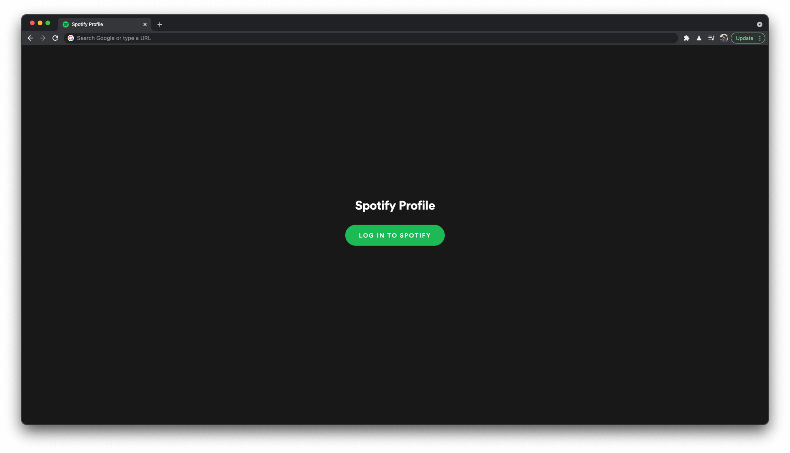
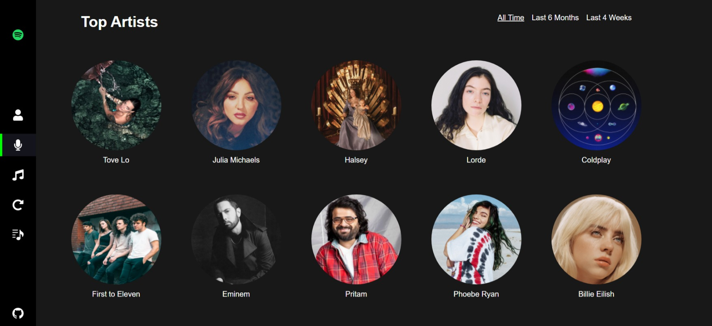
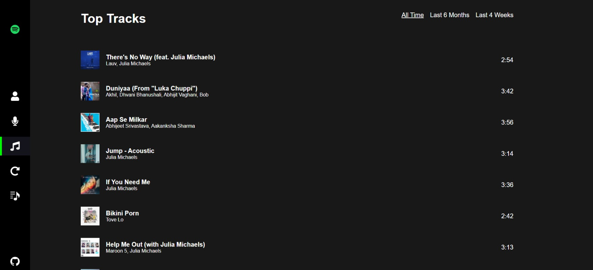
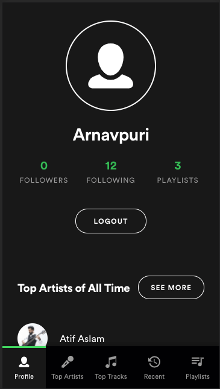
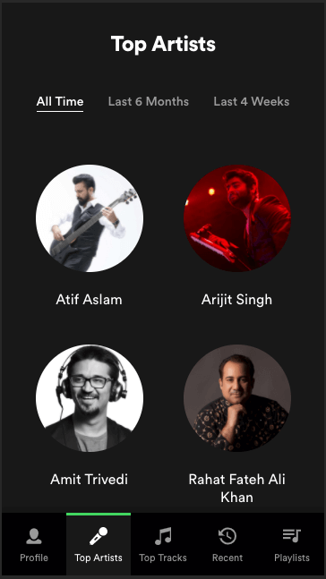

# Spotify Profile App

We will be creating a Spotify Profile overview app which will fetch a Spotify user's info, recent activity, favorite tracks, favorite artists, and playlists.

You need to use `redux` compulsorily in this project.

## Screenshots

1. Login Page
   

2. Profile Page
   

3. Top Artists Page with filters
   

4. Top Tracks Page with filters
   

5. Recent activity (**Stretch**)
   

6. Playlists (**Stretch**)
   

Stretch: Mobile friendly:

